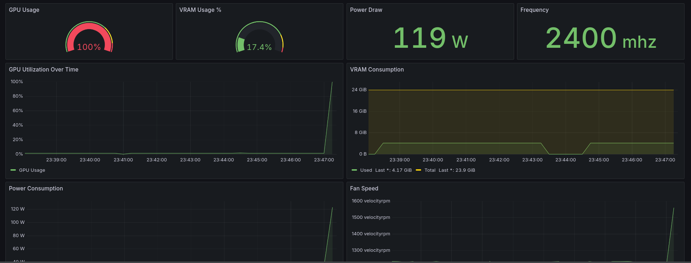

# xe-exporter

> Tested on an Intel Arc B60.



A high-performance Prometheus and OpenTelemetry exporter for Intel Arc GPUs (Battlemage and Alchemist) using the modern Linux `xe` kernel driver and [XPU Manager](https://github.com/intel/xpumanager) via CGo.

## Features

- **OTel Native:** Built using the OpenTelemetry Go SDK for unified metrics.
- **Dual Export:** Supports both Prometheus (`/metrics` endpoint) and OTLP gRPC push.
- **Rich Telemetry:** Utilization, EU array state, per-engine breakdown, power, frequency, temperature, memory, Xe-Link throughput, and RAS error counters.
- **Container Ready:** Rootless image published to GHCR.
- **GPU Power-Gating:** The GPU truly idles between collection cycles — no persistent Level Zero handles, no thermal floor increase.

## Quick Start (container)

```bash
docker pull ghcr.io/nsaintot/xe-exporter:latest

docker run -d --name xe-exporter \
  --device /dev/dri \
  --cap-add SYS_ADMIN \
  -v /sys/kernel/debug:/sys/kernel/debug:ro \
  -p 9101:9101 \
  ghcr.io/nsaintot/xe-exporter:latest
```

| Flag / mount | Why it's needed |
|---|---|
| `--device /dev/dri` | Exposes the GPU render and card nodes to the container |
| `--cap-add SYS_ADMIN` | Required by XPU Manager / Level Zero Sysman for perf counters |
| `-v /sys/kernel/debug:/sys/kernel/debug:ro` | EU array & engine metrics read from debugfs |
| `-p 9101:9101` | Prometheus scrape port |

## How it works

### Subprocess-per-cycle collection

xe-exporter uses a **subprocess-per-cycle** model to avoid keeping the GPU active between collections.

Each `collect-interval` tick, the server process spawns itself with `-collect-once`:

```
xe-exporter (server)
    │
    ├─── every -collect-interval ──▶  xe-exporter -collect-once (subprocess)
    │                                     1. xpumInit()         — open L0 handles
    │                                     2. Phase-1 baseline   — anchor session window
    │                                     3. sleep 1.5 s        — let sampler accumulate
    │                                     4. xpumGetStats()     — gather all metrics
    │                                     5. xpumShutdown()     — stop sampler threads
    │                                     6. write JSON stdout  — hand off to parent
    │                                     7. exit               — OS closes all L0 FDs
    │◀──────────── JSON ─────────────────/
    │  cache result, serve Prometheus
```

The subprocess holds Level Zero DRM file descriptors only for ~3 s (startup + warmup).
On exit the OS releases all handles unconditionally, and the GPU enters its deepest
available idle state until the next cycle.

> **Why not just call `xpumShutdown()` inside the same process?**
> `DeviceManager::close()` and `GPUDeviceStub::~GPUDeviceStub()` are empty in the
> xpumanager source — `zeInit`/`zesInit` are called once and never un-called.
> The DRM file descriptors remain open until process exit regardless.
> A persistent single-process exporter raises the GPU thermal floor by ~12 °C
> even with `collect-interval=60s`.

### Engine utilisation accuracy

Per-engine utilisation (`xe_gpu_engine_util_percent`) is reported as the **arithmetic mean** over the warmup window (~14 samples × 100 ms), not the last single snapshot.

Using the last snapshot (`e.value`) causes bursty workloads (e.g. media encode/decode)
to show 0% whenever the GPU happens to be idle at the end of the warmup window.
The window mean (`e.avg`) is a much better representation of sustained utilisation.

### Two-pass session anchoring

XPUM uses a session-based delta window — "what changed since session 0 last read?".
Because the session state persists across `xpumShutdown`/`xpumInit` cycles (XPUM's
monitor manager is a process-level singleton), without intervention the first
`xpumGetStats` call after startup would measure a window stretching back to the
previous process run.

The subprocess fixes this with a **two-pass design**:
1. **Baseline call** (before warmup) — re-anchors session 0's "last read" timestamp to now. Result discarded.
2. **Data call** (after warmup) — returns the delta over the 1.5 s warmup window.

## Metrics

All metrics carry the labels `gpu_id`, `gpu_uuid`, and `gpu_name`.

### Utilization

| Metric | Description |
|---|---|
| `xe_gpu_utilization_percent` | Overall GPU utilization |
| `xe_gpu_eu_active_percent` | EU array: active (doing work) |
| `xe_gpu_eu_stall_percent` | EU array: stalled (waiting on memory/dependency) |
| `xe_gpu_eu_idle_percent` | EU array: idle (no work assigned) |
| `xe_gpu_engine_util_percent` | Per-engine utilization — extra labels: `engine_type` (`compute`, `render`, `media`, `decoder`, `encoder`, `copy`), `engine_index` |

### Power & Frequency

| Metric | Description |
|---|---|
| `xe_gpu_power_watts` | Power draw in Watts |
| `xe_gpu_frequency_gpu_mhz` | GPU core clock in MHz |
| `xe_gpu_frequency_media_mhz` | Media engine clock in MHz |

### Temperature

| Metric | Description |
|---|---|
| `xe_gpu_temperature_core_celsius` | GPU core temperature in °C |
| `xe_gpu_temperature_memory_celsius` | Memory temperature in °C |

### Memory

| Metric | Description |
|---|---|
| `xe_gpu_memory_used_mebibytes` | VRAM used in MiB |
| `xe_gpu_memory_util_percent` | VRAM utilization in percent |
| `xe_gpu_memory_bandwidth_util_percent` | Memory bandwidth utilization in percent |
| `xe_gpu_memory_read_kbytes_per_second` | Memory read throughput in kB/s |
| `xe_gpu_memory_write_kbytes_per_second` | Memory write throughput in kB/s |

### Fabric

| Metric | Description |
|---|---|
| `xe_gpu_xelink_throughput_kbytes_per_second` | Xe-Link combined throughput in kB/s |

### RAS Error Counters (monotonically increasing)

| Metric | Description |
|---|---|
| `xe_gpu_errors_reset_total` | GPU resets |
| `xe_gpu_errors_programming_total` | Programming errors |
| `xe_gpu_errors_driver_total` | Driver errors |
| `xe_gpu_errors_cache_correctable_total` | Correctable cache errors |
| `xe_gpu_errors_cache_uncorrectable_total` | Uncorrectable cache errors |
| `xe_gpu_errors_memory_correctable_total` | Correctable memory errors |
| `xe_gpu_errors_memory_uncorrectable_total` | Uncorrectable memory errors |

## Requirements

- **Linux Kernel 6.8+** with the `xe` driver loaded.
- **Intel Arc GPU** (Battlemage B-series or Alchemist A-series).
- **Go 1.26+** (build from source only).

## Configuration

| Flag | Default | Description |
|---|---|---|
| `-collect-interval` | `10s` | How often to collect a fresh GPU snapshot. Set this ≥ your Prometheus `scrape_interval`. The GPU idles between cycles (default mode). |
| `-daemon-collector-mode` | `false` | Revert to single-process collection. L0 handles stay open → GPU thermal floor rises ~12 °C. Only use when subprocess spawning is not viable. |
| `-prom-port` | `9101` | Prometheus `/metrics` port |
| `-enable-prom` | `true` | Enable Prometheus endpoint |
| `-otlp-endpoint` | _(none)_ | OTLP gRPC endpoint (e.g. `otel-collector:4317`) |
| `-debug` | `false` | Verbose collection logging (forwarded to each subprocess) |
| `-collect-once` | — | **Internal.** Run one cycle, write JSON to stdout, and exit. Spawned automatically; do not set manually. |

## Prometheus Configuration

```yaml
scrape_configs:
  - job_name: xe-exporter
    static_configs:
      - targets: ['localhost:9101']
    scrape_interval: 15s  # should be ≤ -collect-interval
```

## OpenTelemetry (OTLP push)

```bash
docker run -d --name xe-exporter \
  --device /dev/dri \
  --cap-add SYS_ADMIN \
  -v /sys/kernel/debug:/sys/kernel/debug:ro \
  ghcr.io/nsaintot/xe-exporter:latest \
  -enable-prom=false -otlp-endpoint otel-collector:4317
```

## Build from Source

```bash
git clone https://github.com/nsaintot/xe-exporter
cd xe-exporter
docker build -t xe-exporter .
```

## License

MIT
